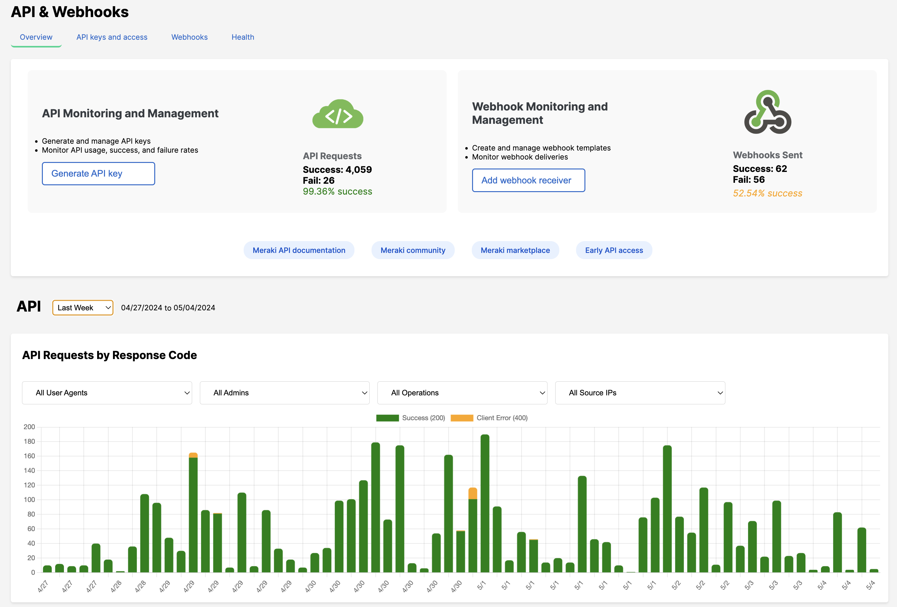

# Meraki API & Webhook Dashboard

## Overview
This is a dashboard for visualizing and analyzing data from the Cisco Meraki Dashboard API. It enables developers and network administrators to monitor API usage, track webhook events, and derive insights through various metrics and trends.

> Note: This is for demonstration purposes and may have incomplete functions. 

## Features
- Visualization of API requests and error trends.
- Detailed webhook logs with success and failure rates.
- Data filtering by response code, source IP, and other criteria.
- Interactive tables with custom filtering capabilities.

## Key API Operations
This tool leverages the following Meraki Dashboard API operations:
- `getOrganizations`: Lists the accessible organizations.
- `getOrganizationAdmins`: Retrieves admins for a given organization.
- `getAdministeredIdentitiesMe`: Retrieves the current user's identity.
- `getOrganizationApiRequests`: Fetches logs of API requests made by an organization.
- `getOrganizationApiRequestsOverviewResponseCodesByInterval`: Provides an overview of API request response codes over specified intervals.
- `getOrganizationApiRequestsOverview`: Gives an overview of API requests for an organization.
- `getOrganizationWebhooksLogs`: Obtains logs for webhooks related to an organization.

## Installation and Usage

### Running the App with Node.js
1. Clone the repository and navigate to the project directory.
2. Run `npm install` to install dependencies.
3. Start the application with `npm start`.
4. Open `http://localhost:3000` in your web browser.

### Using the Dashboard
1. Input your Cisco Meraki API key in the Credentials modal and save your settings.
2. Select an organization to begin fetching relevant data.
3. Use the filtering options to refine displayed data in the tables.

